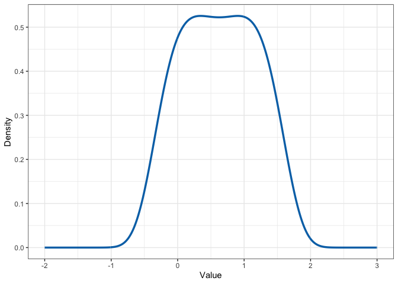

# Exponential Families

Zachary McCaw <br> Updated: 23-01-07

### Description

Collection of functions for working with exponential family
distributions of the form: $$
f(x) = \exp\left\{\sum_{k=0}^{K}\beta_{k}x^{k}\right\}
$$

Notes:

- If $K$ is even, the support of $f(x)$ is assumed to be
  $(-\infty, \infty)$. If $K$ is odd, the support is assumed to be
  $(0, \infty)$.

- The coefficient of the highest order term, i.e. $\beta_{K}$ is assumed
  to be negative.

- The coefficient of the constant term, i.e. $\beta_{0}$ is the log of
  the normalizing constant.

## Installation

``` r
devtools::install_github(repo = "zrmacc/ExpFam")
```

## Functions

### Normalizing constant

Given the coefficients of the non-constant terms
$(\beta_{K}, \beta_{K-1}, \dots, \beta_{1})$, determine the log
normalizing constant $\beta_{0}$. Note the coefficients of the
non-constant terms are given in descending order.

``` r
library(ExpFam)
# Example of the standard normal distribution.
b_in <- c(-0.5, 0)
b_out <- NormalizingConstant(b_in)
```

    ## Assuming support (-inf, inf).

``` r
print(b_out, digits = 3)
```

    ## [1] -0.500  0.000 -0.919

``` r
all.equal(b_out[3], -0.5 * log(2 * pi), tolerance = 0.0001)
```

    ## [1] TRUE

### Density

Obtain the density function. Note that the normalizing constant is
provided hereafter.

``` r
# Example of the standard normal distribution.
b <- c(-0.5, 0, -0.5 * log(2 * pi))
dens <- GetDensity(b)
```

    ## Assuming support (-inf, inf).

``` r
print(dens(0), digits = 3)
```

    ## [1] 0.399

``` r
all.equal(dens(0), dnorm(0), tolerance = 0.0001)
```

    ## [1] TRUE

### Cumulative distribution

Obtain the cumulative distribution function.

``` r
# Example of the standard normal distribution.
b <- c(-0.5, 0, -0.5 * log(2 * pi))
cdf <- GetCDF(b)
```

    ## Assuming support (-inf, inf).

``` r
print(cdf(1), digits = 3)
```

    ## [1] 0.841

``` r
all.equal(cdf(1), pnorm(1), tolerance = 0.0001)
```

    ## [1] TRUE

### Quantile

Evaluate the quantile. Note `GetQuantile` does not return a function but
instead performs the quantile evaluation.

``` r
# Example of the standard normal distribution.
b <- c(-0.5, 0, -0.5 * log(2 * pi))
quants <- GetQuantile(b, probs = c(0.25, 0.50, 0.75))
```

    ## Assuming support (-inf, inf).

``` r
print(quants, digits = 3)
```

    ## [1] -6.74e-01  2.89e-15  6.74e-01

``` r
all.equal(quants, qnorm(p = c(0.25, 0.50, 0.75)), tolerance = 0.0001)
```

    ## [1] TRUE

### Sampling

Sample from an exponential family distribution. The utility of `rExpFam`
is the ability to sample from distributions with K \> 2, for which
built-in functions (e.g. `rnorm`) are not available. The sample is
obtained by numerically inverting the CDF. `rExpFam` requires an
approximate search interval. To determine this interval, it is helpful
to plot the density.

``` r
b_in <- c(-1, 2.5, -2.1875, 0.78125)
b <- NormalizingConstant(b_in)
```

    ## Assuming support (-inf, inf).

Density being sampled:

``` r
library(ggplot2)

# Plot density.
dens <- GetDensity(b)
```

    ## Assuming support (-inf, inf).

``` r
x <- seq(from = -2, to = 3, length.out = 501)
df <- data.frame(x = x, y = dens(x))
q <- ggplot(data = df) + 
  theme_bw() + 
  geom_line(
    aes(x = x, y = y),
    linewidth = 1.2,
    color = "#0072B5FF"
  ) + 
  labs(
    x = "Value",
    y = "Density"
  ) 
show(q)
```



``` r
x <- rExpFam(b = b, n = 10, xmin = -2, xmax = 3)
```

    ## Assuming support (-inf, inf).

``` r
round(x, digits = 3)
```

    ##  [1]  1.024  1.350 -0.028  1.393  0.618  1.071 -0.097  1.267  1.240 -0.109
